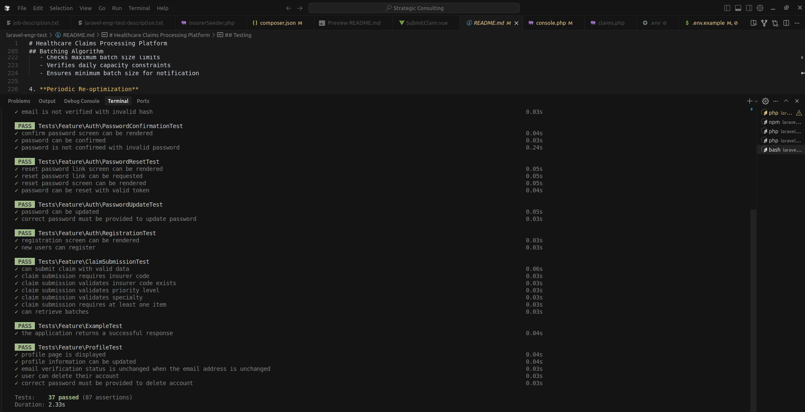

# Healthcare Claims Processing Platform

A Laravel-based system for optimizing the batching and processing of medical claims between healthcare providers and insurers. The system minimizes overall processing costs while meeting various competing constraints.

## Table of Contents

- [Overview](#overview)
- [Features](#features)
- [System Architecture](#system-architecture)
- [Setup Instructions](#setup-instructions)
- [Configuration](#configuration)
- [Usage](#usage)
- [Batching Algorithm](#batching-algorithm)
- [Testing](#testing)
- [API Documentation](#api-documentation)

## Overview

This platform processes healthcare claims by intelligently batching them to minimize processing costs for insurers. The system considers multiple factors including:

- Time of month (processing costs increase from 20% to 50% throughout the month)
- Specialty type efficiency per insurer
- Priority levels (1-5, with higher priorities costing more)
- Monetary value of claims
- Daily processing capacity limits
- Minimum and maximum batch sizes
- Insurer preference for batching dates (encounter vs submission date)

## Features

### Frontend (Vue.js)
- Intuitive claim submission form
- Multi-item claim support with auto-calculated totals
- Real-time batch monitoring with auto-refresh
- Expandable batch views showing claim details
- Responsive design with Tailwind CSS

### Backend (Laravel)
- RESTful API for claim submission and batch retrieval
- Event-driven batch optimization triggered on each claim submission
- Cost calculation engine with multiple factors
- Queue-based email notifications using Laravel Horizon
- Comprehensive test coverage
- Database migrations and seeders

## System Architecture

### Database Schema

- **insurers**: Stores insurer information and processing constraints
- **batches**: Tracks claim batches by provider and date
- **claims**: Individual claim records
- **claim_items**: Line items within each claim

### Core Services

- **ProcessingCostCalculator**: Calculates processing costs based on multiple factors
- **ClaimBatchingService**: Assigns claims to optimal batches
- **OptimizeBatches Job**: Event-driven optimization of claim batches per insurer

### Cost Calculation Formula

```
cost = (base_cost + (total_amount/1000 × 10)) × priority_multiplier × specialty_multiplier × time_of_month_multiplier
```

Where:
- **base_cost**: Insurer-specific base processing cost
- **monetary_value_cost**: 10 units per 1000 in claim value
- **priority_multiplier**: 1x, 2x, 3x, 4x, or 5x based on priority level
- **specialty_multiplier**: Insurer-specific efficiency for medical specialty
- **time_of_month_multiplier**: Linear progression from 0.20 (20%) to 0.50 (50%)

## Setup Instructions

### Prerequisites

- PHP 8.2 or higher
- Composer
- Node.js and NPM
- Redis (for queue management)
- SQLite or MySQL

### Installation Steps

1. **Clone the repository**
   ```bash
   git clone <repository-url>
   cd laravel-engr-test

   # checkout my branch
   git checkout justice-abutu-engr-test-submission
   ```

2. **Install PHP dependencies**
   ```bash
   composer install
   ```

3. **Install JavaScript dependencies**
   ```bash
   npm install
   ```

4. **Set up environment file**
   ```bash
   cp .env.example .env
   php artisan key:generate
   ```

5. **Configure database**
   - For SQLite (default):
     ```bash
     touch database/database.sqlite
     ```
   - Create a separate SQLite database for testing:
     ```bash
     touch database/testing.sqlite
     ```
   - Or update `.env` with your MySQL credentials

6. **Run migrations and seed data**
   ```bash
   php artisan migrate --seed
   ```

7. **Install and configure Laravel Horizon**
   ```bash
   php artisan horizon:install
   ```

## Configuration

### Environment Variables

Add these to your `.env` file:

```env
# Application Configuration
APP_URL=http://localhost:8000  # Update if using non-default Laravel port or host

# Queue Configuration
QUEUE_CONNECTION=redis
REDIS_CLIENT=phpredis
REDIS_HOST=127.0.0.1
REDIS_PASSWORD=null
REDIS_PORT=6379

# Mail Configuration (uses log driver in development)
MAIL_MAILER=log
```

### Running the Application

You need to run **three separate processes**:

1. **Development Server**
   ```bash
   php artisan serve
   ```

2. **Asset Compilation**
   ```bash
   npm run dev
   ```

3. **Queue Worker (Laravel Horizon)**
   ```bash
   php artisan horizon
   ```

The UI is displayed on the root page: `http://localhost:8000`

## Usage

### Submitting a Claim

1. Navigate to the homepage
2. Fill in the claim details:
   - Insurer Code (e.g., INS-A, INS-B, INS-C, INS-D)
   - Provider Name
   - Encounter Date
   - Specialty (select from dropdown)
   - Priority Level (1-5)
3. Add claim items with name, unit price, and quantity
4. Submit the claim
5. The claim will be automatically optimized immediately via a queued job

### Viewing Batches

Batches are displayed in a table below the submission form:
- Auto-refreshes every 60 seconds
- Manual refresh button available
- Expandable rows show claims within each batch
- Color-coded status indicators

### Batch Statuses

- **Pending**: Batch created but not yet ready (claims can be moved)
- **Ready**: Meets minimum batch size and ready for processing (claims can still be moved)
- **Notified**: Insurer has been notified via email (claims are locked and cannot be moved)

## Batching Algorithm

### Overview

The batching algorithm optimizes claim assignments to minimize total processing costs while respecting insurer constraints.

For a comprehensive explanation of the algorithm including design decisions, complexity analysis, and trade-offs, see **[ALGORITHM_EXPLANATION.md](ALGORITHM_EXPLANATION.md)**.

### Algorithm Strategy

1. **Window-Based Optimization**
   - Considers a 4-day window from the claim's base date
   - Evaluates costs for each possible batch date

2. **Cost Minimization**
   - Calculates processing cost for each date in the window
   - Selects the date with the lowest cost

3. **Constraint Validation**
   - Checks maximum batch size limits
   - Verifies daily capacity constraints
   - Ensures minimum batch size for notification

4. **Event-Driven Optimization**
   - Triggered immediately upon each claim submission
   - Re-evaluates all pending and batched claims for the affected insurer
   - Can move claims between batches that haven't been sent to insurers
   - Once a batch is notified, its claims are locked to ensure data integrity

### Complexity Analysis

- **Time Complexity**: O(n × w) where n = number of claims, w = optimization window (4 days)
- **Space Complexity**: O(n) for storing claim and batch data
- **Scalability**: Supports thousands of claims with efficient database indexing

### Trade-offs

- **Cost vs. Speed**: 4-day window balances cost optimization with timely processing
- **Re-optimization Trigger**: Event-driven approach ensures immediate optimization on submission
- **Batch Flexibility**: Claims can be moved between batches until insurers are notified, allowing continuous optimization while ensuring data integrity

## Testing

> **Note:** Before running tests, ensure that both the development server (`php artisan serve`) and asset compilation (`npm run dev`) are running. Some tests will fail without these processes active.

### Run All Tests

```bash
php artisan test
```



### Run Specific Test Suites

```bash
# Unit tests only
php artisan test --testsuite=Unit

# Feature tests only
php artisan test --testsuite=Feature
```

### Test Coverage

- **Unit Tests**: Cost calculation, batching logic, model relationships
- **Feature Tests**: API endpoints, validation, claim submission workflow

## API Documentation

### Submit Claim

**POST** `/api/claims`

**Request Body:**
```json
{
  "insurer_code": "INS-A",
  "provider_name": "Dr. John Doe",
  "encounter_date": "2024-01-15",
  "priority_level": 3,
  "specialty": "cardiology",
  "items": [
    {
      "name": "Consultation",
      "unit_price": 100.00,
      "quantity": 1
    },
    {
      "name": "X-Ray",
      "unit_price": 50.00,
      "quantity": 2
    }
  ]
}
```

**Response:**
```json
{
  "success": true,
  "message": "Claim submitted successfully",
  "data": {
    "claim_id": 1,
    "total_amount": 200.00,
    "status": "pending"
  }
}
```

### Get Batches

**GET** `/api/batches`

**Response:**
```json
{
  "success": true,
  "data": [
    {
      "id": 1,
      "identifier": "Dr. John Doe 2024-01-15",
      "insurer": {
        "code": "INS-A",
        "name": "HealthFirst Insurance"
      },
      "batch_date": "2024-01-15",
      "total_claims": 5,
      "total_amount": "1,250.00",
      "status": "ready",
      "claims": [...]
    }
  ]
}
```

## Seeded Insurers

The system comes with 4 pre-configured insurers:

1. **HealthFirst Insurance (INS-A)**
   - Base cost: $10, Capacity: 100/day
   - Prefers encounter date, Efficient at cardiology

2. **MediCare Plus (INS-B)**
   - Base cost: $15, Capacity: 80/day
   - Prefers submission date, Efficient at orthopedics

3. **United Health Partners (INS-C)**
   - Base cost: $12.50, Capacity: 120/day
   - Prefers encounter date, Efficient at neurology/radiology

4. **Premier Care Insurance (INS-D)**
   - Base cost: $20, Capacity: 60/day
   - Prefers submission date, Efficient at pediatrics/psychiatry

## Extra Notes

### Testing the Batching System

For faster demonstration of the batching and notification features, I recommend:

- **Focus on one insurer**: Use **INS-D (Premier Care Insurance)** which has the lowest minimum batch size, allowing batches to become "ready" faster
- **Use a consistent provider name**: Keep the same provider name across multiple claims so they batch together
- **Use the current or previous day**: Set encounter dates to today or yesterday to trigger immediate batch processing

This approach will quickly demonstrate how claims are optimized into batches and how notifications are triggered once the minimum batch size is met.

### Queue Management

- Laravel Horizon dashboard: `http://localhost:8000/horizon`
- Monitor job execution, failures, and throughput
- View batch notification dispatches

### Email Notifications

- In development, emails are logged to `storage/logs/laravel.log`
- In production, configure your mail driver in `.env`

### Database

The default setup uses SQLite for simplicity. For production, use MySQL or PostgreSQL by updating the `.env` file.

---

**Developed for the Senior Full-stack Laravel Engineer Test**
